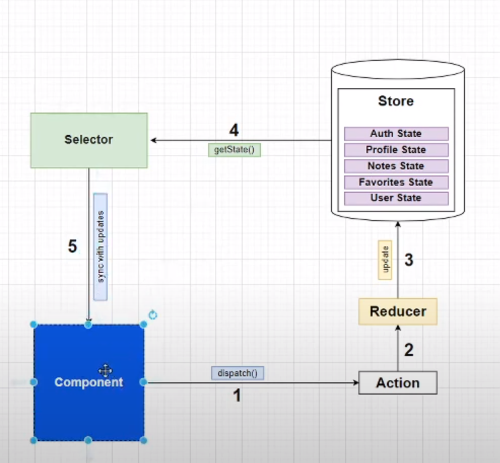

# Redux

## What is Redux

 state management library It provides a centralized store to hold the entire state of the application, and the state can only be modified through actions. Redux follows the principles of a `unidirectional data flow`, making it easier to understand and debug complex state interactions.

## key concepts

1. `Store`: The store is a single JavaScript object that represents the entire state of the application. It is immutable, meaning that the state cannot be directly modified. Instead, changes are made by dispatching actions.

1. `Actions`: Actions are plain JavaScript objects that describe an event that should modify the state. They must have a type property indicating the type of action and may include additional data.

1. `Reducers`: Reducers are pure functions responsible for handling actions and modifying the state accordingly. A reducer takes the current state and an action, and returns a new state. Reducers should not have side effects.

1. `Dispatch`: Dispatch is a function provided by the Redux store that is used to send actions to the store. When an action is dispatched, the store passes the action to the reducer, which calculates the new state.

1. `Selectors`: Selectors are functions that extract specific pieces of data from the state. They help in accessing and transforming the state in a consistent manner.

## Redux components in details

+ Reducer is responsible for
    1. init state
    1. update state(immutable)
    1. logic to handle state
    1. send state to store.
